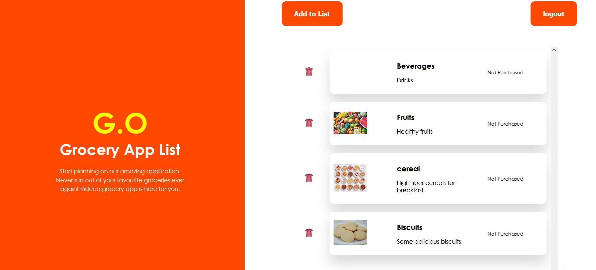

# Frontend for Rideco Grocery_App

A simple grocery purchase planning app done with React.
## Available Scripts

In the project directory, you can run:

### `yarn start`

Runs the app in the development mode.\
Open [http://localhost:3000](http://localhost:3000) to view it in the browser.

### `cypress test`

Sample e2e testing setup in cypress, but non-exhaustive.

### Setup

The backend for this project is available in another repository. Backend was done with Python using the Django framework.

### Link to Backend:
https://github.com/Oyinoye/Grocery_App_Backend

Setup the backend and start using the app.

### Visualizer

